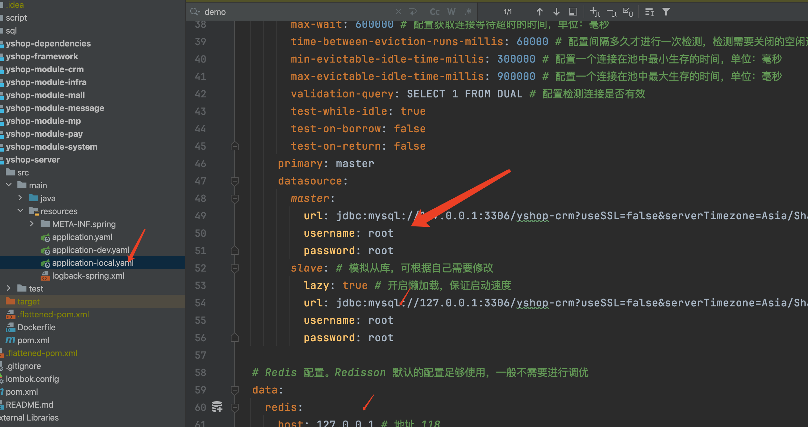
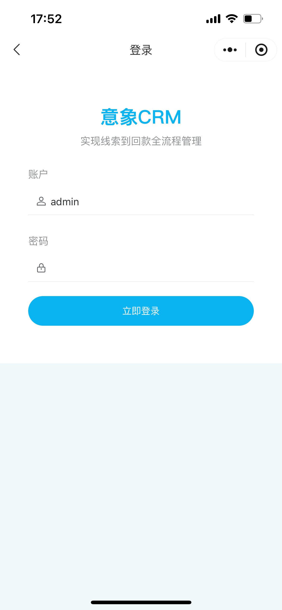
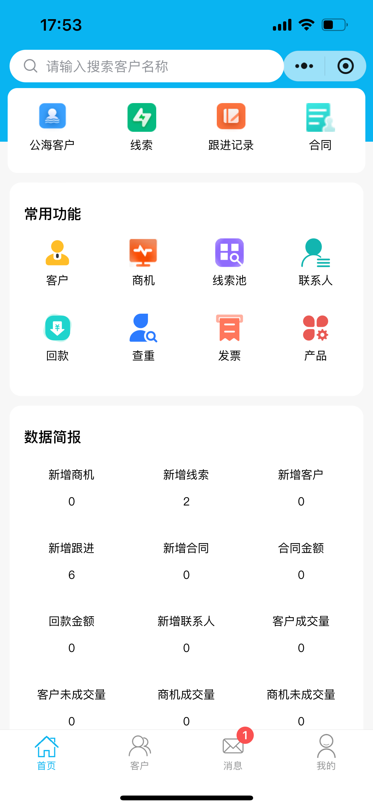
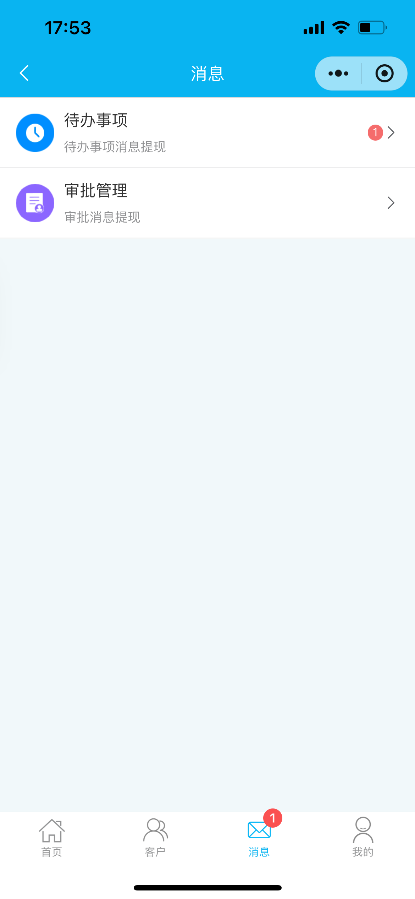
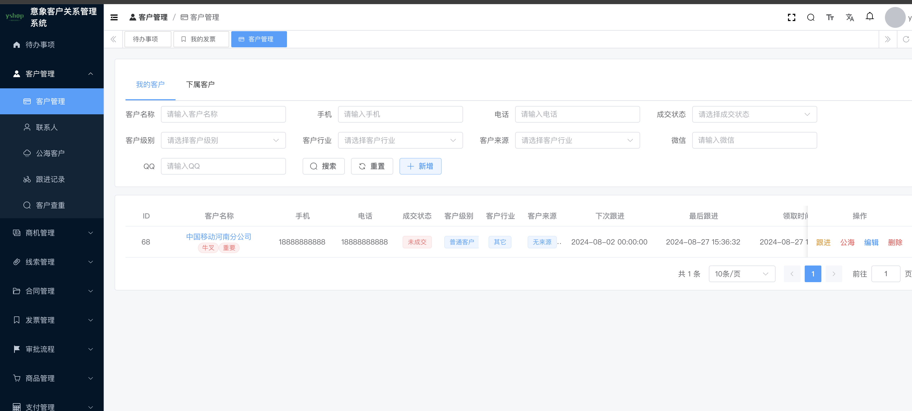
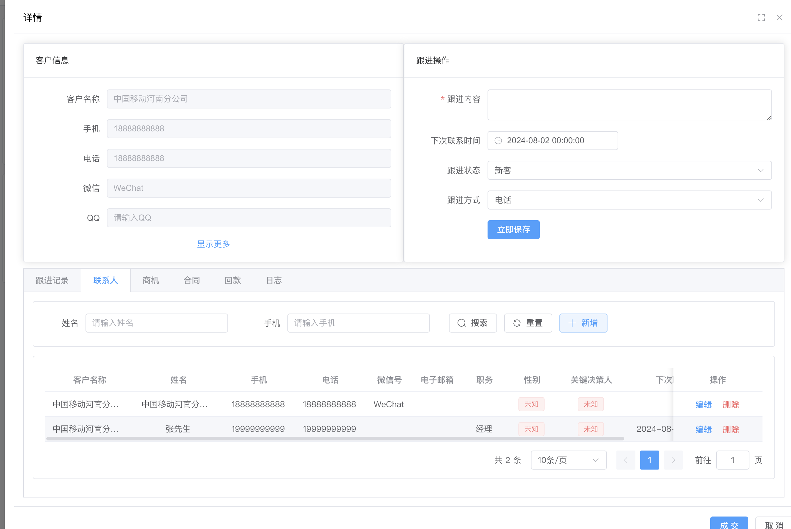
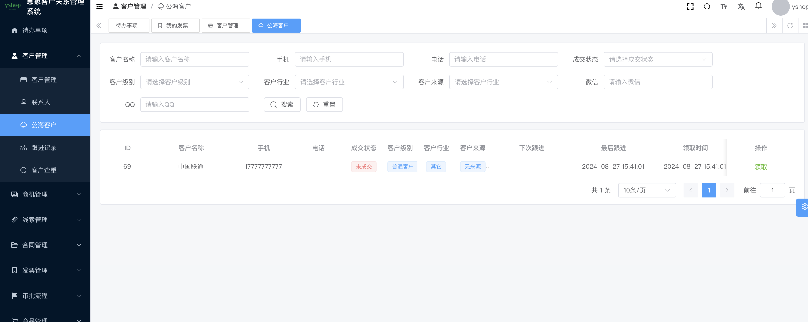
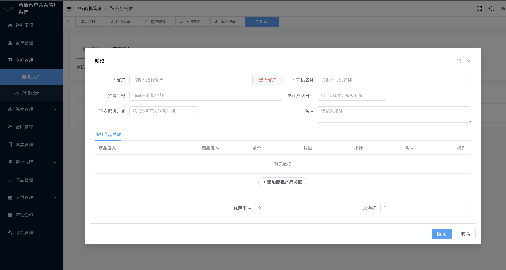
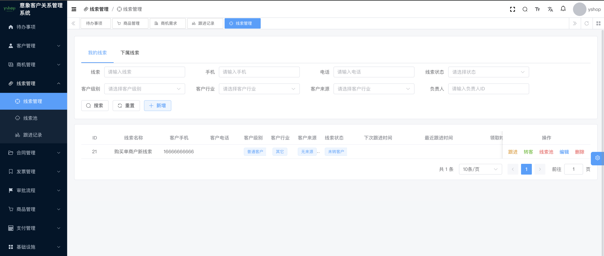
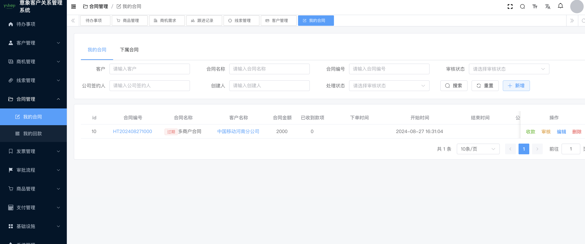

## 平台简介

yshop-crm意象客户关系管理系统，专门为企业销售团队量身定制的工具，能够有效的管理跟进客户提供销售业绩，无缝斜街打通YSHOP单商户系统！技术： SpringBoot3、Spring Security OAuth2、MybatisPlus、SpringSecurity、jwt、redis、Vue3的前后端分离的系统

官网地址：[https://www.yixiang.co/](https://www.yixiang.co/)


## 演示地址

| 后台登陆：  | https://crm.yixiang.co/   账号/密码：admin/admin123  |
|---|---|
|  关注右边公众号可以体验移动端小程序 |  |

## 功能列表
| 待办事项 | 统计、待审核事项                    |
|------|-----------------------------|
| 数据分析 | 员工业绩、客户级别、客户行业、合同排行等 |
| 客户管理 | 客户列表、客户跟踪、联系人、公海、客户查重、客户领取、批量导入、转移客户、发邮件等 |
| 商机管理 | 商机需求、跟进、产品添加、查看详情、发邮件、发短信等          |
| 线索管理 | 线索列表、跟进、线索池、转客、批量导入等             |
| 合同管理 | 合同列表、商品录入、详情、审核、收款回款、打印合同等       |
| 发票管理 | 添加发票、开具、审核等                 |
| 云呼中心 | 云呼坐席、呼叫记录                 |
| 企业微信 | 企业微信配置、企业微信员工、企业微信客户   |
| CRM设置 | 审核流程 、业绩目标、通知管理、客户规则配置      |
| 商品管理 | 商品分类、商品规格、商品列表              |
| 移动端| uniapp移动端支持小程序             |


## 视频资料
如果对您有帮助，您可以点右上角 "Star" 支持一下，这样我们才有继续免费下去的动力，谢谢！ QQ交流群 (入群前，请在网页右上角点 "Star" )，群里有视频教程与开发文档哦！！

交流QQ群：544263002

## 项目说明
    
```
    yshop-crm.             Java工程
    yshop-crm-vue          后台前端vue3工程
```

## 本地快速启动
  ##### 1、环境要求
   
    ```
        jdk17
        mysql8
        redis6+
        node16+
        maven3.8+
    
    ```
  ##### 2、开发工具
   
    ```
        idea
        vscode
    
    ```
 ##### 3、后端启动

-   3.1 请使用idea打开Java工程，自动会安装依赖
-   3.2 创建数据库且导入工程目录下sql/yshop-crm.sql 文件
-   3.3 找到项目下的yshop-server 的yml,修改数据库相关信息和redis相关信息，如图：
     
-   3.4 工程下输入
    ``` 
    mvn clean install package '-Dmaven.test.skip=true'
    ```
-   3.5 启动项目

##### 4、后台vue启动

 - 4.1 vscode 打开vue工程，在目录下输入命令: 
    ``` 
    pnpm install
    ```
 - 4.2 配置api如图
 
 - 4.3 本地启动:
    ```
     npm run dev
    ```
## 手机端截图

|   |   |
|---|---|
|   |   |
|   |   |


## 后台截图

|   |   |
|---|---|
|   |   |
|   |   |
|   |   |
|   |   |
|   |   |
|   |   |


## 技术栈
- Spring Boot3

- Spring Security oauth2

- MyBatis

- MyBatisPlus

- Redis

- lombok

- hutool

- Vue3

- Element UI

- uniapp(vue3)

## 特别鸣谢


- ruoyi-vue-pro:https://gitee.com/zhijiantianya/ruoyi-vue-pro
- element-plus:https://element-plus.gitee.io/zh-CN/
- vue:https://cn.vuejs.org/
- pay-java-parent:https://gitee.com/egzosn/pay-java-parent


## 开源协议

本项目采用比 Apache 2.0 更宽松的 [MIT License](https://gitee.com/guchengwuyue/crm/blob/master/LICENSE) 开源协议，个人与企业可 100% 免费使用，不用保留类作者、Copyright 信息。

