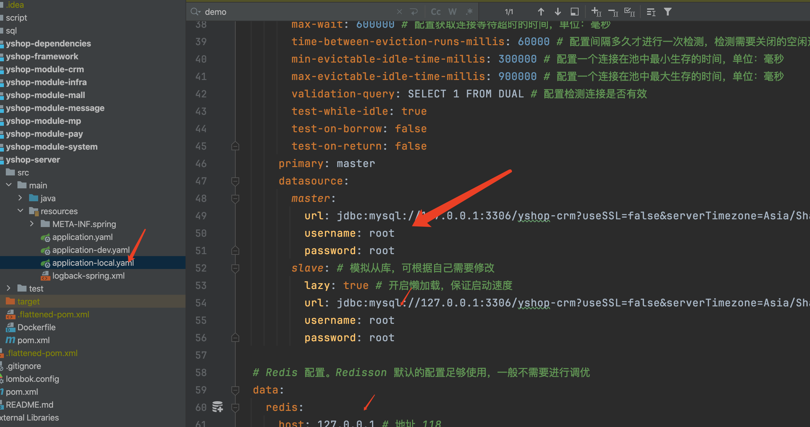
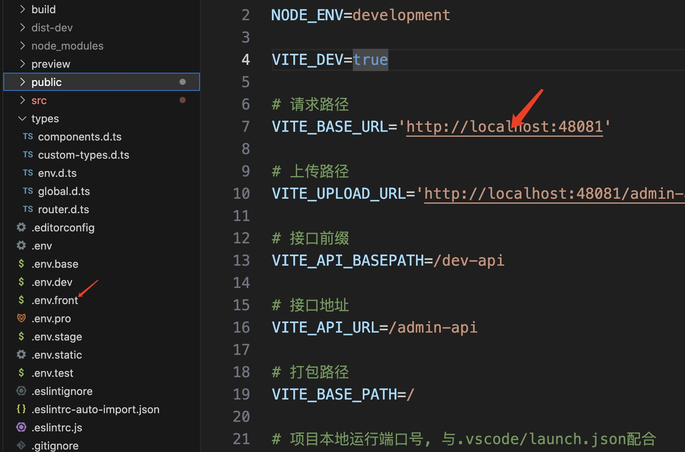
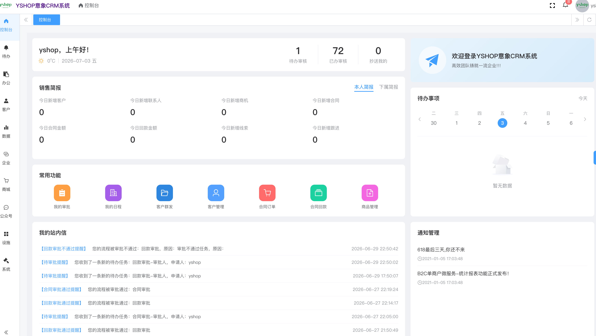
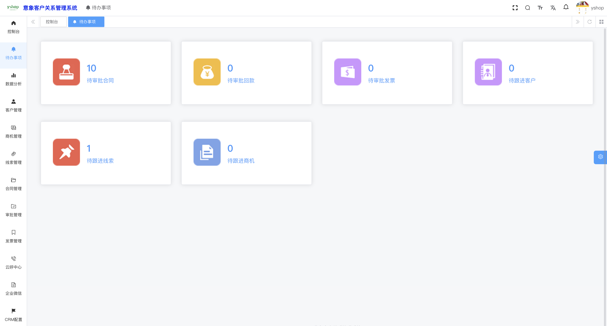
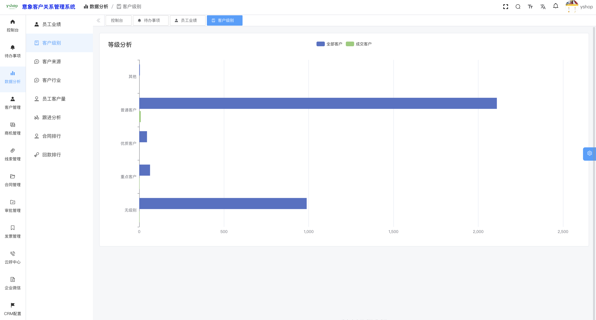
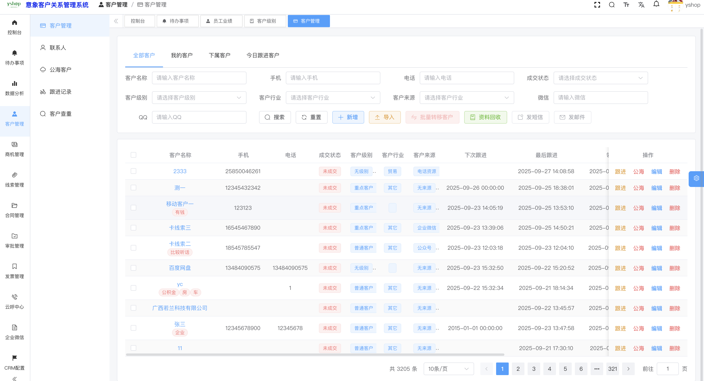
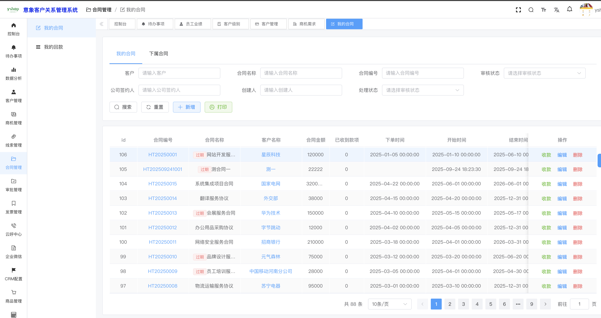
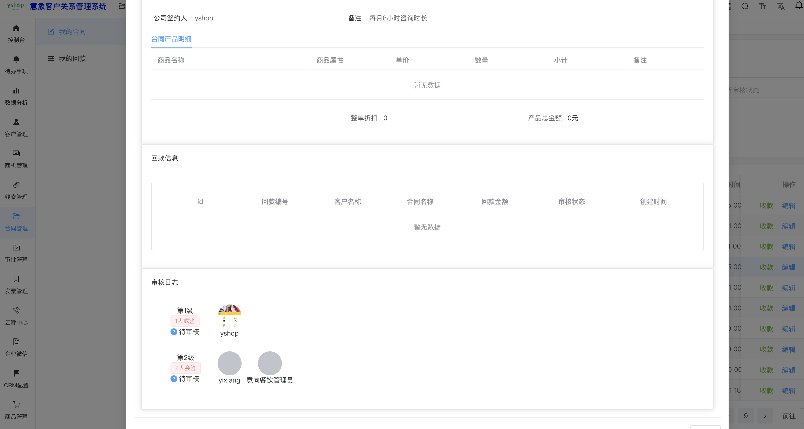

## 平台简介

yshop-crm意象CRM系统(支持企业微信)，旨在助力企业销售全流程精细化、数字化管理，全面解决企业销售团队的全流程客户服务难题，帮助企业有效盘活客户资源、量化销售行为，合理配置资源、建立科学销售体系，提升销售业绩！技术： SpringBoot3、Spring Security OAuth2、MybatisPlus、SpringSecurity、jwt、redis、Vue3的前后端分离的系统

官网地址：[https://www.yixiang.co/](https://www.yixiang.co/)


## 演示地址

| 后台登陆：  | https://crm.yixiang.co/   账号/密码：admin/admin123  |
|---|---|
|  关注右边公众号可以体验移动端小程序 |  |
| 二开与定制： |   |

## 功能列表
| 控制台 | 销售简报、我的业绩统计                  |
|------|-----------------------------|
| 待办 | 待办事项比如审批、待跟进等|
| 办公 | 审批管理、流程管理、日程管理、通知管理 |
| 客户| 线索管理、客户管理、商机管理、合同管理、发票管理、客户标签、呼呼中心、系统配置、scrm企业微信群发         |
| 数据| 业绩目标、员工业绩、客户级别、客户来源、客户行业、跟进分析、合同排行             |
| 企业 | 员工管理、角色管理、部门管理、岗位管理     |
| 商城 | 商品分类、商品规格、商品列表 、支付配置        |
| 移动端| uniapp移动端支持小程序             |
| 公众号| 粉丝管理、模板消息等        |


## 视频资料
如果对您有帮助，您可以点右上角 "Star" 支持一下，这样我们才有继续免费下去的动力，谢谢！ QQ交流群 (入群前，请在网页右上角点 "Star" )，群里有视频教程与开发文档哦！！

交流QQ群：544263002

## 项目说明
    
```
    yshop-crm.             Java工程
    yshop-crm-vue          后台前端vue3工程
```

## 本地快速启动
  ##### 1、环境要求
   
    ```
        jdk17
        mysql8
        redis6+
        node16+
        maven3.8+
    
    ```
  ##### 2、开发工具
   
    ```
        idea
        vscode
    
    ```
 ##### 3、后端启动

-   3.1 请使用idea打开Java工程，自动会安装依赖
-   3.2 创建数据库且导入工程目录下sql/yshop-crm.sql 文件
-   3.3 找到项目下的yshop-server 的yml,修改数据库相关信息和redis相关信息，如图：
     
-   3.4 工程下输入
    ``` 
    mvn clean install package '-Dmaven.test.skip=true'
    ```
-   3.5 启动项目

##### 4、后台vue启动

 - 4.1 vscode 打开vue工程，在目录下输入命令: 
    ``` 
    pnpm install
    ```
 - 4.2 配置api如图
 
 - 4.3 本地启动:
    ```
     npm run dev
    ```
## 手机端截图

|  |  |
|---|---|
|  |   |
|  |   |


## 后台截图

|   | 
|---|---|
|   | 
|   | 
|   | 
|   |  
|   |  


## 技术栈
- Spring Boot3

- Spring Security oauth2

- MyBatis

- MyBatisPlus

- Redis

- lombok

- hutool

- Vue3

- Element UI

- uniapp(vue3)

## 特别鸣谢


- ruoyi-vue-pro:https://gitee.com/zhijiantianya/ruoyi-vue-pro
- element-plus:https://element-plus.gitee.io/zh-CN/
- vue:https://cn.vuejs.org/
- pay-java-parent:https://gitee.com/egzosn/pay-java-parent


## 开源协议

本项目采用比 Apache 2.0 更宽松的 [MIT License](https://gitee.com/guchengwuyue/crm/blob/master/LICENSE) 开源协议，个人与企业可 100% 免费使用，不用保留类作者、Copyright 信息。

