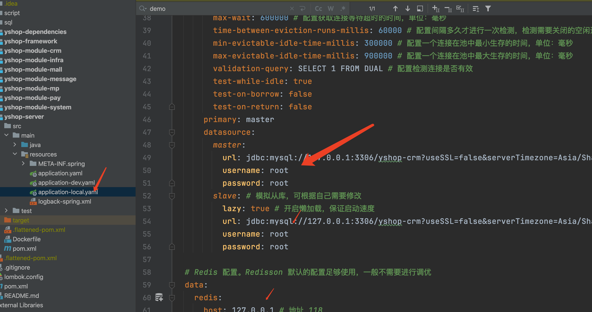
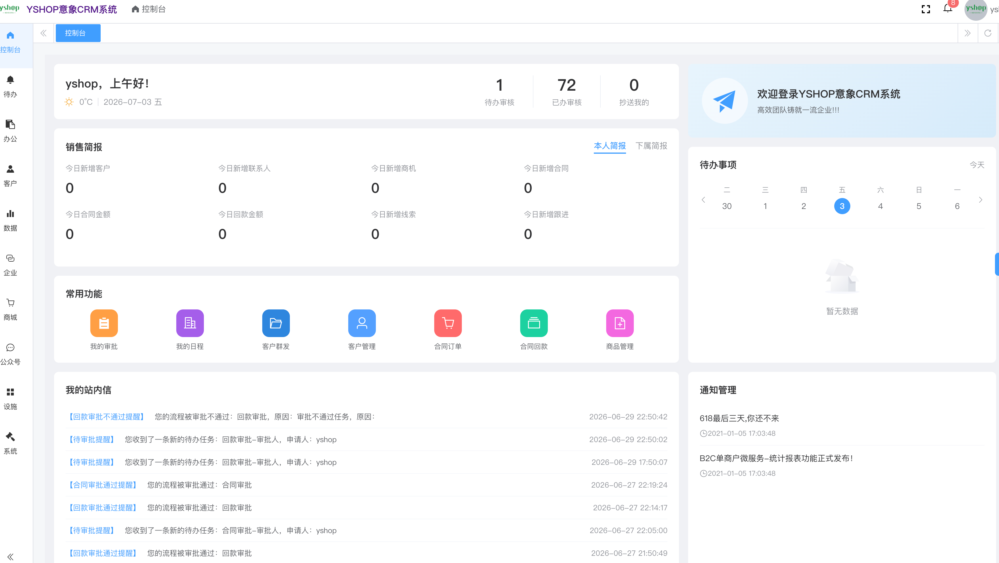
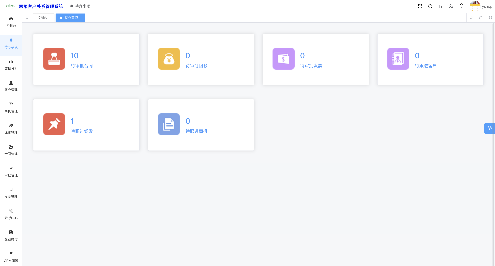
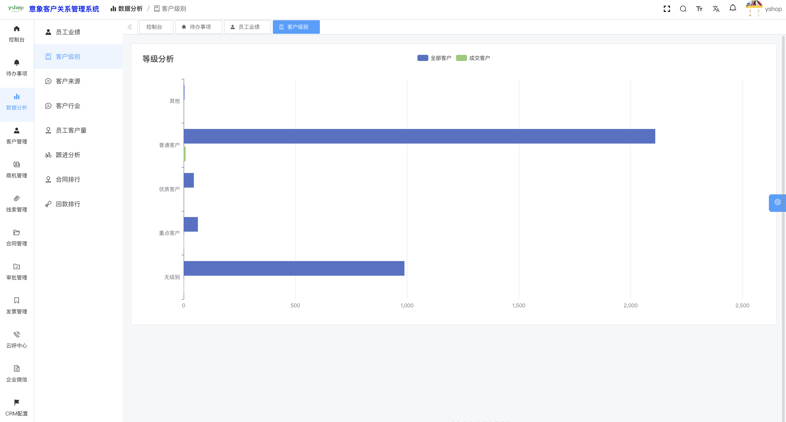
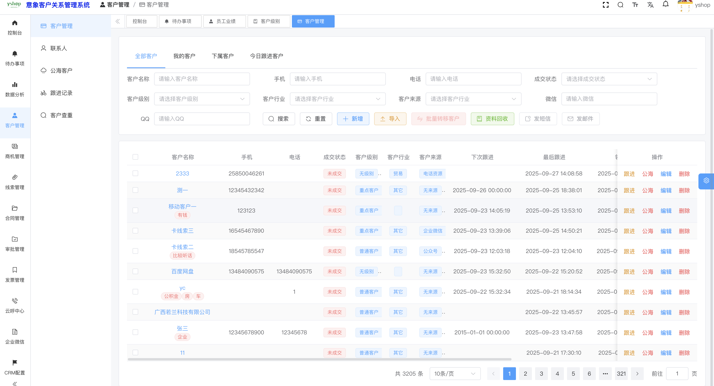
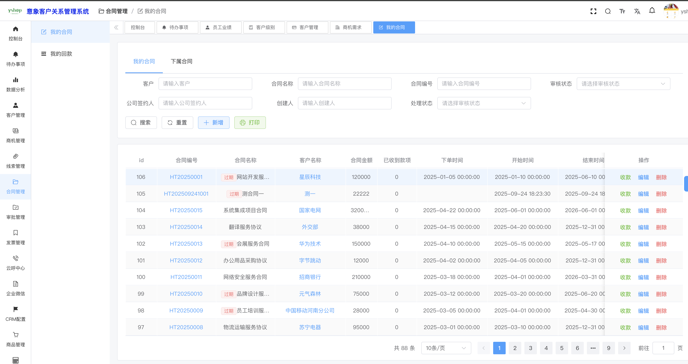
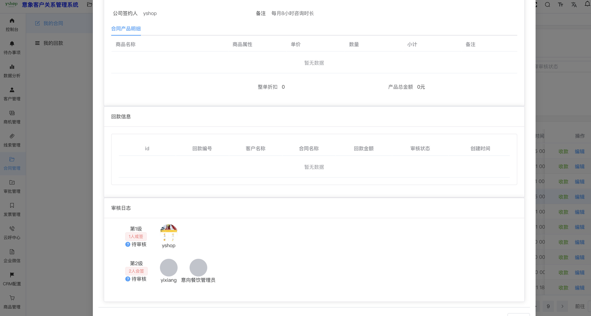

# YSHOP 意象开源系列

> Spring Boot 3 + Vue3 前后端分离，覆盖 CRM 销售管理与物资仓库库存两大场景。

**官网：** [https://www.yixiang.co/](https://www.yixiang.co/)

---

## 产品一览

<table>
<tr>
<td width="50%" valign="top">

### yshop-crm 意象 CRM

支持企业微信的前后端分离 CRM，助力企业销售全流程精细化、数字化管理。

盘活客户资源、量化销售行为、合理配置资源，建立科学销售体系，提升销售业绩。

**定位：** 线索 → 客户 → 商机 → 合同 → 回款

**适用：** 销售团队 / SCRM / 企业微信协同

**技术栈：** Spring Boot 3 · Spring Security OAuth2 · MyBatis Plus · JWT · Redis · Vue3 · uni-app

</td>
<td width="50%" valign="top">

### yshop-stock 意象库存

物质仓库库存管理系统，面向中小企业仓管、采购与业务协同，覆盖多规格、出入库、库存时序与单据审核打印。

把库存账做准、单据流程做规范、物资流转看得清。

**定位：** 建档 → 入库 → 出库 → 查询 / 时序 → 打印存档

**适用：** 贸易商 / 门店仓 / 小型仓储中心

**技术栈：** Spring Boot 3 · Spring Security · MyBatis Plus · Redis · Vue3 · Element Plus

</td>
</tr>
</table>

---

## 演示地址

<table>
<tr>
<td width="50%" valign="top">

### CRM 演示

| 入口 | 说明 |
|------|------|
| **后台** | [https://crm.yixiang.co/](https://crm.yixiang.co/)<br>账号 / 密码：`admin` / `admin123` |
| **移动端** | 关注公众号即可体验小程序<br> |
| **二开与定制** |  |

</td>
<td width="50%" valign="top">

### Stock 演示

| 入口 | 说明 |
|------|------|
| **后台** | [https://lite.yixiang.co/](https://lite.yixiang.co/) |
| **建议路径** | 商品多规格 → 入库审核 → 出库审核 → 库存查询 / 时序 |
| **咨询购买** | [购买地址](https://www.yixiang.co/shop/a/1.html)<br>关注公众号联系售前 |

</td>
</tr>
</table>

---

## 功能列表

<table>
<tr>
<td width="50%" valign="top">

### CRM 功能

| 模块 | 功能 |
|------|------|
| 控制台 | 销售简报、我的业绩统计 |
| 待办 | 审批、待跟进等待办事项 |
| 办公 | 审批管理、流程管理、日程管理、通知管理 |
| 客户 | 线索 / 客户 / 商机 / 合同 / 发票、标签、呼叫中心、SCRM 企微群发、自定义字段、拜访签到 |
| 数据 | 业绩目标、员工业绩、客户级别 / 来源 / 行业、跟进分析、合同排行 |
| 企业 | 员工、角色、部门、岗位管理 |
| 商城 | 商品分类、规格、列表、支付配置 |
| 移动端 | uni-app 小程序 |
| 公众号 | 粉丝管理、模板消息等 |

</td>
<td width="50%" valign="top">

### Stock 功能

| 模块 | 功能 |
|------|------|
| 商品管理 | 多规格 SKU（颜色、尺寸等），按规格维护库存维度 |
| 商品入库 | 关联供应商创建入库单，审核后自动增加库存 |
| 商品出库 | 关联客户 / 领用场景创建出库单，审核后扣减库存 |
| 库存查询 | 按商品、规格查看当前库存余额 |
| 库存时序 | 增减变化时间线，还原「何时、因何单、变多少」 |
| 单据打印 | 出入库单 A5 打印，便于签收与存档 |
| 审核机制 | 出入库单审核生效 / 反审核回退 |
| 客户管理 | 客户档案，出库可关联去向 |
| 供应商管理 | 供应商档案，入库可关联来源 |
| 移动端 | 手机端入库、出库、库存查询（开发中） |

**项目价值：** 账实一致 · 流程可控 · 规格精细 · 协同高效

**业务闭环：** 建商品/规格 → 建客户/供应商 → 入库审核 → 出库审核 → 库存查询与时序 → A5 打印存档

</td>
</tr>
</table>

---

## 视频资料

如果对您有帮助，欢迎点右上角 **Star** 支持一下，这样我们才有继续免费下去的动力，谢谢！

QQ 交流群（入群前请先 Star）：**544263002**  
群内有视频教程与开发文档。

---

## 项目说明（CRM）

| 目录 | 说明 |
|------|------|
| `yshop-crm` | Java 后端工程 |
| `yshop-crm-vue` | 后台前端 Vue3 工程 |

---

## 本地快速启动（CRM）

### 1. 环境要求

| 依赖 | 版本 |
|------|------|
| JDK | 17 |
| MySQL | 8 |
| Redis | 6+ |
| Node.js | 16+ |
| Maven | 3.8+ |

### 2. 开发工具

- IDEA（后端）
- VS Code（前端）

### 3. 后端启动

1. 使用 IDEA 打开 Java 工程，自动安装依赖  
2. 创建数据库，导入工程目录下 `sql/yshop-crm.sql`  
3. 修改 `yshop-server` 下 yml 中的数据库与 Redis 配置：

   

4. 在工程目录执行：

   ```bash
   mvn clean install package '-Dmaven.test.skip=true'
   ```

5. 启动项目

### 4. 后台 Vue 启动

1. 用 VS Code 打开 Vue 工程，执行：

   ```bash
   pnpm install
   ```

2. 配置 API：

   

3. 本地启动：

   ```bash
   npm run dev
   ```

---

## 手机端截图（CRM）

| | |
|:---:|:---:|
|  |  |
|  |  |
|  |  |

---

## 后台截图（CRM）

| |
|:---:|
|  |
|  |
|  |
|  |
|  |
|  |

---

## 技术栈

<table>
<tr>
<td width="50%" valign="top">

### CRM

**后端：** Spring Boot 3 · Spring Security OAuth2 · MyBatis / MyBatis Plus · Redis · Lombok · Hutool

**前端：** Vue 3 · Element Plus · uni-app（Vue3）

</td>
<td width="50%" valign="top">

### Stock

**后端：** Spring Boot 3 · Spring Security · MyBatis / MyBatis Plus · Redis · Lombok · Hutool

**前端：** Vue 3 · Element Plus

</td>
</tr>
</table>

---

## 特别鸣谢

- [ruoyi-vue-pro](https://gitee.com/zhijiantianya/ruoyi-vue-pro)
- [Element Plus](https://element-plus.gitee.io/zh-CN/)
- [Vue](https://cn.vuejs.org/)
- [pay-java-parent](https://gitee.com/egzosn/pay-java-parent)

---

## 开源协议

本项目采用比 Apache 2.0 更宽松的 [MIT License](https://gitee.com/guchengwuyue/crm/blob/master/LICENSE) 开源协议，个人与企业可 100% 免费使用，不用保留类作者、Copyright 信息。
